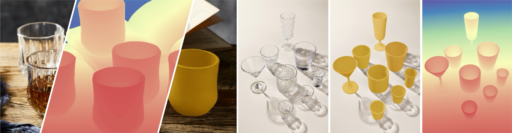

# SeeClear: Reliable Transparent Object Depth Estimation via Generative Opacification

<p align="center">
  <a href="https://arxiv.org/abs/2603.19547"></a>
  <a href="https://heyumeng.com/SeeClear-web/"></a>
  <a href="#local-gradio-demo"></a>
  <a href="#model-files"></a>
  <a href="#dataset"></a>
</p>

<p align="center">
  Xiaoying Wang<sup>*</sup>, Yumeng He<sup>*</sup>, Jingkai Shi<sup>*</sup>, Jiayin Lu, Yin Yang, Ying Jiang, Chenfanfu Jiang
</p>

<p align="center">
  
</p>

SeeClear is a plug-and-play framework for transparent-object depth estimation.
It first turns transparent regions into geometry-consistent opaque appearances,
then feeds the optimized image to an off-the-shelf monocular depth estimator.
The depth model is kept unchanged, while depth predictions around transparent
objects become more stable.

This repository contains the inference pipeline, the diffusion opacification
training code, the mask refinement training code, and a Gradio demo that can be
run on your own GPU server.

## News

- **2026-03-20**: SeeClear is available on arXiv.
- **Coming soon**: Pretrained checkpoints, dataset links, and hosted demo links
  will be added.

## Method Overview

Given an RGB image with transparent objects, SeeClear runs:

1. Transparent-object mask preparation with Trans4Trans, an uploaded mask, SAM3,
   or GSAM2.
2. Conditional diffusion opacification inside the transparent regions.
3. Lightweight mask refinement after generation.
4. Opaque image compositing.
5. Monocular depth prediction with Depth Anything 3 or MoGe.

The default automatic segmentation mode uses Trans4Trans. SAM3 and GSAM2 are
kept as optional mask preparation tools in the demo.

## Installation

Create the environment:

```bash
git clone https://github.com/YumengHe/SeeClear.git
cd SeeClear
conda env create -f environment.yaml
conda activate seeclear
```

The release environment is intended to cover training, inference, and the full
local demo. CUDA 12.1 compatible NVIDIA drivers are recommended.

## Model Files

This is a code-only release. Model weights and datasets are not included.

Required SeeClear checkpoints:

```text
pretrained_models/clip-vit-large-patch14/
pretrained_models/seeclear_pretrained.ckpt
pretrained_models/seeclear_opacification.ckpt
pretrained_models/mask_refiner.pth
```

The default diffusion training command fine-tunes from
`pretrained_models/seeclear_pretrained.ckpt`. To reproduce training from the
original Paint-by-Example initialization, provide:

```text
pretrained_models/pbe_pretrained.ckpt
```

Optional model files for automatic segmentation and interactive demo modes:

```text
pretrained_models/sam2.1_hiera_large.pt
pretrained_models/sam3.pt
pretrained_models/trans4trans_medium.pth
```

## Local Gradio Demo

To start a local Gradio demo, activate the environment and run:

```bash
conda activate seeclear
python -m demo.app
```

Gradio prints the local URL in the terminal after the server starts.

## Command-Line Inference

### Image to Depth

This runs automatic mask prediction, opacification, mask refinement,
compositing, and depth prediction:

```bash
python -m demo.run_once \
  --image examples/demo/1.jpg \
  --mask-source trans4trans \
  --depth-source da3 \
  --work-dir outputs/demo/image_to_depth \
  --stem demo \
  --seed 42 \
  --unipc-steps 10
```

### Image and Mask to Depth

This uses existing masks and skips automatic segmentation:

```bash
python -m demo.run_once \
  --image examples/demo/1.jpg \
  --mask examples/demo/masks \
  --mask-source upload \
  --depth-source da3 \
  --work-dir outputs/demo/mask_to_depth \
  --stem demo \
  --seed 42 \
  --unipc-steps 10
```

### Image and Mask to Opaque

This runs only diffusion opacification, mask refinement, and compositing:

```bash
python scripts/infer_opacification.py \
  --image examples/demo/1.jpg \
  --mask examples/demo/masks \
  --work_dir outputs/demo/mask_to_opaque \
  --stem demo \
  --opacification_ckpt pretrained_models/seeclear_opacification.ckpt \
  --config configs/opacification_inference.yaml \
  --mask_refiner_path pretrained_models/mask_refiner.pth \
  --unipc_steps 10 \
  --seeds 42 \
  --batch_size 8 \
  --prep_mode fast
```

## Training

Training expects paired transparent-object data under:

```text
dataset/my_data/
  opaque/
  transparent/
  mask/
  train_list.txt
  val_list.txt
  test_list.txt
```

Each filename listed in `train_list.txt`, `val_list.txt`, or `test_list.txt`
should exist in all three image directories. `opaque/` contains the target
opaque images, `transparent/` contains the input transparent images, and `mask/`
contains aligned binary object masks. Large datasets should be symlinked into
this layout rather than committed to the repository.

Create the split files:

```bash
python scripts/split_dataset.py \
  --data_dir dataset/my_data \
  --train_size <num_train> \
  --val_size <num_val> \
  --test_size <num_test> \
  --seed 42
```

Training uses `train_list.txt` for optimization and `val_list.txt` for
validation. `test_list.txt` is reserved for final evaluation and is not used
while training.

Fine-tune the diffusion opacification model from the released SeeClear
checkpoint:

```bash
bash train.sh
```

Reproduce training from the original Paint-by-Example initialization:

```bash
bash train.sh --from-pbe
```

Train the mask refinement head:

```bash
bash train_mask_refiner.sh -s5
```

## Dataset

The paper introduces **SeeClear-396k**, a paired synthetic dataset of
transparent and opaque renderings with aligned masks, depth, and normals. The
dataset is not included in this code-only release.

## Citation

If you find SeeClear useful, please cite:

```bibtex
@article{wang2026seeclear,
  title={SeeClear: Reliable Transparent Object Depth Estimation via Generative Opacification},
  author={Wang, Xiaoying and He, Yumeng and Shi, Jingkai and Lu, Jiayin and Yang, Yin and Jiang, Ying and Jiang, Chenfanfu},
  journal={arXiv preprint arXiv:2603.19547},
  year={2026}
}
```

## Acknowledgements

SeeClear builds on latent diffusion models, transparent-object segmentation
models, and modern monocular depth estimators. We thank the authors and
maintainers of these open-source projects.
